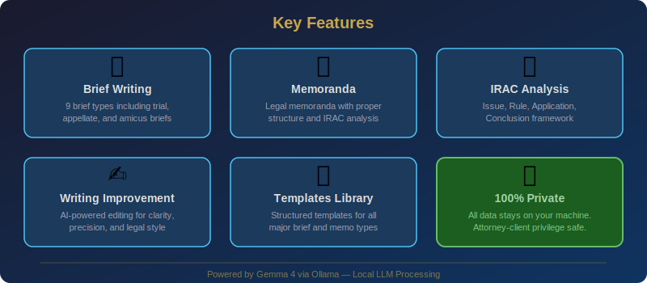

<p align="center">
  
</p>

<p align="center">
  <strong>AI-powered legal brief and memoranda generation with complete privacy</strong>
</p>

<p align="center">
  <a href="#features"></a>
  <a href="#quick-start"></a>
  <a href="#privacy--security"></a>
  <a href="#license"></a>
</p>

<p align="center">
  <a href="#cli-usage">CLI</a> •
  <a href="#web-ui">Web UI</a> •
  <a href="#rest-api">REST API</a> •
  <a href="#docker">Docker</a> •
  <a href="#brief-types">Brief Types</a> •
  <a href="#contributing">Contributing</a>
</p>

---

> **🔒 Attorney-Client Privilege Safe:** All data is processed 100% locally using Ollama.
> No data is ever transmitted to external servers. Your case files, facts, and legal analyses
> never leave your machine.

---

## 📋 Table of Contents

- [Features](#features)
- [Architecture](#architecture)
- [Quick Start](#quick-start)
- [Docker](#docker)
- [CLI Usage](#cli-usage)
- [Web UI](#web-ui)
- [REST API](#rest-api)
- [Brief Types](#brief-types)
- [IRAC Analysis](#irac-analysis)
- [Writing Improvement](#writing-improvement)
- [Configuration](#configuration)
- [Testing](#testing)
- [Project Structure](#project-structure)
- [Privacy & Security](#privacy--security)
- [Legal Disclaimer](#legal-disclaimer)
- [Contributing](#contributing)
- [Changelog](#changelog)
- [License](#license)

---

## ✨ Features

<p align="center">
  
</p>

- **📝 Legal Brief Generation** — Write complete trial briefs, appellate briefs, amicus briefs, and more with proper structure and legal formatting
- **📋 Memoranda Drafting** — Generate objective legal memoranda with Question Presented, Brief Answer, Discussion, and Conclusion sections
- **🔍 IRAC Analysis** — Structured Issue-Rule-Application-Conclusion analysis for any legal question
- **✍️ Writing Improvement** — AI-powered editing that improves clarity, precision, citation format, and legal style
- **📚 Templates Library** — 9 built-in templates covering all major brief and memorandum types with proper section structures
- **🔒 100% Private** — All processing happens locally via Ollama. Zero external API calls. Attorney-client privilege safe
- **🖥️ Multiple Interfaces** — CLI with Rich formatting, Streamlit web UI with dark theme, FastAPI REST API with OpenAPI docs
- **📥 Export & Download** — Download generated briefs as text files from any interface
- **⚡ Table of Authorities** — Automatic extraction and formatting of cited authorities in Bluebook format
- **🐳 Docker Ready** — Full Docker and docker-compose setup with Ollama integration

---

## 🏗️ Architecture

<p align="center">
  
</p>

The Legal Brief Writer uses a modular architecture:

1. **Interface Layer** — CLI (Click + Rich), Web UI (Streamlit), REST API (FastAPI)
2. **Core Engine** — Brief writing, memoranda, IRAC analysis, writing improvement, template management
3. **LLM Layer** — Local Ollama instance running Gemma 4 with zero external connectivity
4. **Privacy Boundary** — All components run within the local machine boundary

---

## 🚀 Quick Start

### Prerequisites

- **Python 3.10+**
- **[Ollama](https://ollama.ai)** installed and running
- **Gemma 4** model pulled

### Installation

```bash
# 1. Navigate to the project
cd 90-local-llm-projects/95-legal-brief-writer

# 2. Install Ollama (if not already installed)
# Visit https://ollama.ai for installation instructions

# 3. Pull Gemma 4
ollama pull gemma4:latest

# 4. Install Python dependencies
pip install -r requirements.txt

# 5. Install the package (optional, for CLI entry point)
pip install -e .
```

### Verify Installation

```bash
# Check Ollama is running
curl http://localhost:11434/api/tags

# Run tests
python -m pytest tests/ -v

# Run the demo
python examples/demo.py
```

---

## 🐳 Docker

### Using Docker Compose (Recommended)

```bash
# Start all services (Web UI + API + Ollama)
docker-compose up -d

# Pull Gemma 4 in the Ollama container
docker exec legal-brief-writer-ollama ollama pull gemma4:latest

# Access the services:
# Web UI: http://localhost:8501
# API:    http://localhost:8000
# Docs:   http://localhost:8000/docs
```

### Using Docker Alone

```bash
# Build the image
docker build -t legal-brief-writer .

# Run (requires external Ollama)
docker run -p 8501:8501 \
  -e OLLAMA_HOST=http://host.docker.internal:11434 \
  legal-brief-writer
```

### Stop Services

```bash
docker-compose down
```

---

## 💻 CLI Usage

The CLI provides a full-featured command-line interface with Rich formatting.

### Write a Brief

```bash
brief-writer write \
  --type memorandum_of_law \
  --case-name "Smith v. Acme Corp" \
  --case-number "2024-CV-01234" \
  --court "U.S. District Court, W.D. Texas" \
  --jurisdiction Federal \
  --client-position Plaintiff \
  --opposing-party "Acme Corporation" \
  --facts-file facts.txt \
  --issues "Whether defendant breached the duty of care" \
  --arguments "Defendant failed to maintain safe premises" \
  --output brief.txt
```

### Write a Memorandum

```bash
brief-writer memo \
  --case-name "Doe v. Roe" \
  --question "Is the employer vicariously liable under respondeat superior?" \
  --facts "Employee caused accident during deliveries on assigned route" \
  --output memo.txt
```

### IRAC Analysis

```bash
brief-writer irac \
  --issue "Whether a duty of care exists between landlord and tenant" \
  --facts "Tenant was injured due to unfixed stairway hazard reported 3 months prior"
```

### Improve Legal Writing

```bash
brief-writer improve \
  --text "The defendant was careless and the plaintiff got hurt real bad" \
  --output improved.txt
```

### List Available Templates

```bash
brief-writer templates
```

### Show Legal Disclaimer

```bash
brief-writer disclaimer
```

---

## 🌐 Web UI

Launch the Streamlit web interface:

```bash
streamlit run src/brief_writer/web_ui.py
```

Then open **http://localhost:8501** in your browser.

### Features

- **Dark theme** with legal gold accents
- **Tabbed interface**: Write Brief, Memorandum, IRAC Analysis, Improve Writing
- **Sidebar**: Case details form, model selection, temperature control
- **Interactive**: Expandable sections, download buttons, word count display
- **Real-time**: Status indicators for Ollama connection

---

## 🔌 REST API

Launch the FastAPI server:

```bash
uvicorn src.brief_writer.api:app --host 0.0.0.0 --port 8000
```

### Interactive Docs

- **Swagger UI**: http://localhost:8000/docs
- **ReDoc**: http://localhost:8000/redoc

### Endpoints

| Method | Endpoint | Description |
|--------|----------|-------------|
| `GET` | `/health` | Health check and Ollama status |
| `POST` | `/brief` | Generate a legal brief |
| `POST` | `/memorandum` | Generate a legal memorandum |
| `POST` | `/irac` | Perform IRAC analysis |
| `POST` | `/improve` | Improve legal writing |
| `GET` | `/templates` | List available brief templates |

### Example: Generate a Brief

```bash
curl -X POST http://localhost:8000/brief \
  -H "Content-Type: application/json" \
  -d '{
    "brief_type": "trial_brief",
    "case_details": {
      "case_name": "Smith v. Jones",
      "court": "District Court",
      "client_position": "Plaintiff"
    },
    "facts": "On January 15, plaintiff was injured...",
    "issues": "Whether defendant breached duty of care",
    "arguments": "Defendant failed to maintain safe premises"
  }'
```

### Example: IRAC Analysis

```bash
curl -X POST http://localhost:8000/irac \
  -H "Content-Type: application/json" \
  -d '{
    "issue": "Whether an employer is vicariously liable",
    "facts": "Employee caused accident during work hours on assigned route"
  }'
```

### Example: Improve Writing

```bash
curl -X POST http://localhost:8000/improve \
  -H "Content-Type: application/json" \
  -d '{
    "text": "The defendant was negligent because they failed to act properly."
  }'
```

---

## 📚 Brief Types

| Brief Type | Value | Description |
|-----------|-------|-------------|
| **Trial Brief** | `trial_brief` | Brief filed with the trial court to persuade the judge on legal issues |
| **Appellate Brief** | `appellate_brief` | Brief filed with an appellate court challenging or defending a lower court decision |
| **Amicus Brief** | `amicus_brief` | Brief filed by a non-party (friend of the court) to provide additional perspective |
| **Memorandum of Law** | `memorandum_of_law` | Document presenting legal arguments to a court on a specific motion |
| **Memorandum in Support** | `memorandum_in_support` | Memorandum supporting a specific motion filed with the court |
| **Memorandum in Opposition** | `memorandum_in_opposition` | Memorandum opposing a motion filed by the opposing party |
| **Reply Brief** | `reply_brief` | Reply brief responding to the opposition's arguments |
| **Legal Memorandum** | `legal_memorandum` | Objective internal memo analyzing legal issues for a supervising attorney |
| **Case Summary** | `case_summary` | Concise summary of a court case's key elements |

---

## 🔍 IRAC Analysis

The IRAC method is a fundamental legal analysis framework:

- **Issue** — Identifies the legal question to be resolved
- **Rule** — States the applicable legal rule(s) with proper citations
- **Application** — Applies the rule to the specific facts of the case
- **Conclusion** — Draws a conclusion based on the analysis

```python
from src.brief_writer.core import write_irac_analysis

result = write_irac_analysis(
    issue="Whether the defendant owed a duty of care to the plaintiff",
    facts="Plaintiff was a business invitee on defendant's commercial property..."
)

print(f"Issue: {result.issue}")
print(f"Rule: {result.rule}")
print(f"Analysis: {result.analysis}")
print(f"Conclusion: {result.conclusion}")
```

---

## ✍️ Writing Improvement

The writing improvement tool analyzes legal text and provides:

- **Improved Text** — Rewritten version with better clarity and precision
- **Changes Made** — List of specific changes and why they were made
- **Suggestions** — Additional recommendations for the author
- **Readability Score** — Assessment of overall readability
- **Legal Accuracy Notes** — Flags for potential accuracy concerns

```python
from src.brief_writer.core import improve_legal_writing

result = improve_legal_writing(
    text="The defendant was negligent because they failed to act properly."
)

print(result["improved_text"])
for change in result["changes"]:
    print(f"  • {change}")
```

---

## ⚙️ Configuration

### config.yaml

```yaml
app:
  name: "Legal Brief Writer"
  version: "1.0.0"

llm:
  model: "gemma4:latest"
  temperature: 0.4        # Lower = more precise legal language
  max_tokens: 8192         # Enough for comprehensive briefs
  ollama_host: "http://localhost:11434"

writing:
  default_brief_type: "memorandum_of_law"
  max_word_count: 15000

logging:
  level: "INFO"
  format: "%(asctime)s - %(name)s - %(levelname)s - %(message)s"
```

### Environment Variables

| Variable | Default | Description |
|----------|---------|-------------|
| `LLM_MODEL` | `gemma4:latest` | Ollama model name |
| `LLM_TEMPERATURE` | `0.4` | Generation temperature |
| `LLM_MAX_TOKENS` | `8192` | Max response tokens |
| `OLLAMA_HOST` | `http://localhost:11434` | Ollama server URL |
| `LOG_LEVEL` | `INFO` | Logging level |

Environment variables override `config.yaml` settings.

---

## 🧪 Testing

```bash
# Run all tests
python -m pytest tests/ -v

# Run with coverage
python -m pytest tests/ -v --cov=src/brief_writer --cov-report=term-missing

# Run a specific test
python -m pytest tests/test_core.py::TestWriteBrief -v
```

All tests use mocked LLM responses — no running Ollama instance required for testing.

---

## 📁 Project Structure

```
95-legal-brief-writer/
├── src/brief_writer/           # Main package
│   ├── __init__.py             # Package metadata
│   ├── core.py                 # Core brief generation engine
│   ├── cli.py                  # Click CLI with Rich formatting
│   ├── web_ui.py               # Streamlit web interface
│   ├── api.py                  # FastAPI REST API
│   └── config.py               # Configuration management
├── tests/
│   └── test_core.py            # Comprehensive test suite
├── examples/
│   ├── demo.py                 # Interactive demo script
│   └── README.md               # Usage examples
├── docs/images/
│   ├── banner.svg              # Project banner
│   ├── architecture.svg        # System architecture diagram
│   └── features.svg            # Features overview
├── .github/workflows/
│   └── ci.yml                  # CI pipeline
├── common/
│   ├── __init__.py             # Common package
│   └── llm_client.py           # Shared Ollama client
├── config.yaml                 # Application configuration
├── setup.py                    # Package setup
├── requirements.txt            # Python dependencies
├── Makefile                    # Build automation
├── Dockerfile                  # Multi-stage Docker build
├── docker-compose.yml          # Docker Compose (3 services)
├── .dockerignore               # Docker ignore rules
├── .env.example                # Environment template
├── README.md                   # This file
├── CONTRIBUTING.md             # Contribution guidelines
└── CHANGELOG.md                # Version history
```

---

## 🔒 Privacy & Security

This project is designed with **attorney-client privilege** in mind:

| Aspect | Implementation |
|--------|----------------|
| **Data Processing** | 100% local via Ollama — zero external API calls |
| **Network** | No outbound connections to cloud services |
| **Storage** | No persistent storage of generated content (unless you save files) |
| **Model** | Gemma 4 runs entirely on your local hardware |
| **Telemetry** | Zero telemetry, analytics, or tracking |
| **Logs** | Local-only logging — nothing transmitted externally |

### For Law Firms

- ✅ Safe for privileged and confidential information
- ✅ No third-party data processing agreements needed
- ✅ Compliant with ABA Model Rule 1.6 (Confidentiality of Information)
- ✅ No risk of training data contamination
- ✅ Full control over your data at all times

---

## ⚖️ Legal Disclaimer

> **This tool generates legal documents using AI and is intended for DRAFTING
> ASSISTANCE ONLY.** All output must be reviewed, verified, and approved by a
> licensed attorney before use in any legal proceeding.
>
> This tool does **NOT** constitute legal advice. The developers assume no
> liability for the accuracy, completeness, or applicability of any generated
> content. Use at your own risk.
>
> The AI may generate plausible-sounding but incorrect legal citations,
> misstate legal standards, or omit relevant authorities. **Always verify
> all citations, legal standards, and arguments independently.**

---

## 🤝 Contributing

Contributions are welcome! Please see [CONTRIBUTING.md](CONTRIBUTING.md) for guidelines.

1. Fork the repository
2. Create a feature branch
3. Add tests for new features
4. Ensure all tests pass
5. Submit a pull request

---

## 📋 Changelog

See [CHANGELOG.md](CHANGELOG.md) for version history and release notes.

---

## 📄 License

This project is part of the [90 Local LLM Projects](https://github.com/kennedyraju55/90-local-llm-projects) collection and is licensed under the **MIT License**.

---

<p align="center">
  <strong>⚖️ Legal Brief Writer</strong><br/>
  <em>AI-powered legal drafting with complete privacy</em><br/><br/>
  <a href="#quick-start">Get Started</a> •
  <a href="#cli-usage">CLI</a> •
  <a href="#web-ui">Web UI</a> •
  <a href="#rest-api">API</a> •
  <a href="https://github.com/kennedyraju55/90-local-llm-projects">GitHub</a>
</p>
